# KubeVirt @ SUSE: Status update

## Introduction

Even with rapid adoption of containerization technologies there is still a high demand for using virtual machines. Nowadays Kubernetes has become the de-facto standard when it comes to orchestration of containerized workloads. However originally it does not have the capability to operate with VMs. KubeVirt is an add-on for Kubernetes that aims to fill that gap. It integrates into the Kubernetes ecosystem and allows running and managing virtual machines at scale.

In this talk we will cover the current status of KubeVirt development at SUSE. We will highlight the major aspects of maintaining the downstream packages and container images and how they fit with the build infrastructure. We will then talk about the upstream contributions and ongoing activities. And we will also show the results of our recent research about running CPU, memory and disk IO workloads in KubeVirt VMs and plain KVM VMs, and from where the differences in terms of performance come from.


## What is KubeVirt?

[KubeVirt][1] is a virtualization management add-on for Kubernetes. It allows running virtual machines alongside the containerized workloads in a seamless and unified way on a single platform. Kubevirt extends Kubernetes by introducing new custom resource (CR) types: VirtualMachine (VM) and VirtualMachineInstance (VMI). Those are used to model various settings and options supported by KubeVirt and the underlying virtualization stack. The definition of a VM looks like bellow:

```yaml
apiVersion: kubevirt.io/v1
kind: VirtualMachine
metadata:
  labels:
    kubevirt.io/vm: vm-cirros
  name: vm-cirros
spec:
  running: false
  template:
    metadata:
      labels:
        kubevirt.io/vm: vm-cirros
    spec:
      domain:
        devices:
          disks:
          - disk:
              bus: virtio
            name: containerdisk
          - disk:
              bus: virtio
            name: cloudinitdisk
        resources:
          requests:
            memory: 128Mi
      terminationGracePeriodSeconds: 0
      volumes:
      - containerDisk:
          image: registry:5000/kubevirt/cirros-container-disk-demo:devel
        name: containerdisk
      - cloudInitNoCloud:
          userData: |
            #!/bin/sh

            echo 'printed from cloud-init userdata'
        name: cloudinitdisk
```

The core KubeVirt [components][2] (pods) are:
- virt-api – API server; the entry point for all virtualization-related requests
- virt-controller – monitors CRs (i.e. VMs, VMIs, etc.) and manages associated pods
- virt-handler – privileged pod (DaemonSet) that runs on each node in the cluster
- virt-launcher – hosts the main VMI process (Libvirt daemon + Qemu)
- virt-operator – manages KubeVirt deployment


KubeVirt runs VMs in pods (one per VM) thus allowing them to be managed by Kubernetes in the same fashion as standard container applications.


## Downstream: KubeVirt @ SUSE

KubeVirt is written in Go language and it uses Bazel for building the binaries and container images. When it comes to downstream maintenance and integration with the Open Build Service (OBS), Bazel, unfortunately, does not turn out to be very “friendly”. The upstream build is based on Fedora packages and it requires several gigabytes of dependencies to be downloaded and stored in the repository. That makes it pretty hard and resource consuming to build the project in the “upstream-way”. In order to mitigate that problem the downstream build has been based on the native Go approach. As a result it has been split into two steps.

First, the main KubeVirt package is built in OBS as a standard spec-file project. It provides the RPMs with all the needed artifacts. Some of the RPMs are just “intermediate” and used only for building the “virt containers” later on.

Then at the second step the container images are built out of Dockerfiles. The “intermediate” RPMs with the binaries from the first step are “consumed” and installed in the final images:

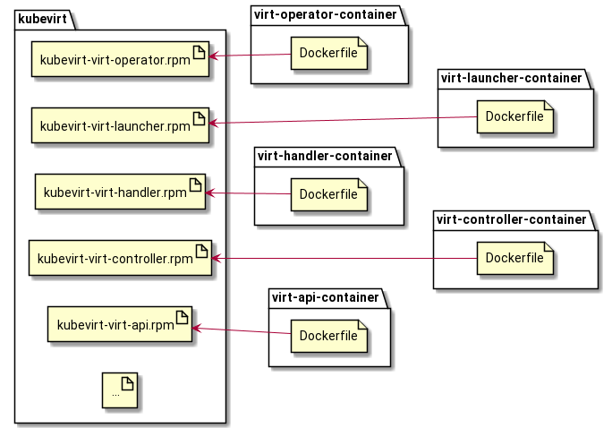

That way it becomes easy to customize and build KubeVirt containers on top of openSUSE or SLE base images. E.g. the resulting Dockerfile (simplified a little bit though) may look like the following:

```Dockerfile
...
# virt-launcher container image
# KUBEVIRTFROM defined in prjconf, e.g.
#  BuildFlags: dockerarg:KUBEVIRTFROM=opensuse/tumbleweed
ARG KUBEVIRTFROM
FROM $KUBEVIRTFROM
...
RUN zypper -n install \
    ...
    kubevirt-container-disk \
    kubevirt-virt-launcher \
    ...
...
```

However such a “two-steps” approach introduces several challenges.

### Challenge #1: consistency

KubeVirt is usually deployed to the cluster using the manifests. Those are YAML files with settings and definitions. The manifests include the information about the container registry to pull the images from and the corresponding tags. This info gets generated during the build of the RPMs but it is also required in the Dockerfiles for proper tagging. I.e. the tags of the resulting container images must exactly match the tags generated in the manifests. Providing those manually for each container image every time a new release comes out is error-prone and time consuming.

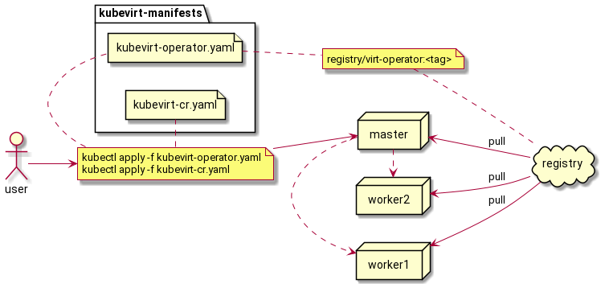

A solution towards automation of the process has been based on OBS build services. It is heavily inspired by *docker_label_helper*, *kiwi_metainfo_helper* and *obs-service-replace_using_package_version*. An OBS service can be used as an equivalent of *BuildRequires* spec-file directive to pre-install dependencies into the build environment for container images. For the KubeVirt build the two additional services have been introduced:

**obs-service-replace_using_env** – this is an independent generic OBS service that reads the environment variables from a given file and performs the substitution in the sources (e.g. in the Dockerfile).

**obs-service-kubevirt_containers_meta** – another build service that gets **generated** during the build along with the manifests RPM. It provides the environment file specific for the KubeVirt use-case. The file is consumed by *obs-service-replace_using_env* during the build of container images and all the required metadata gets injected into the Dockerfile.

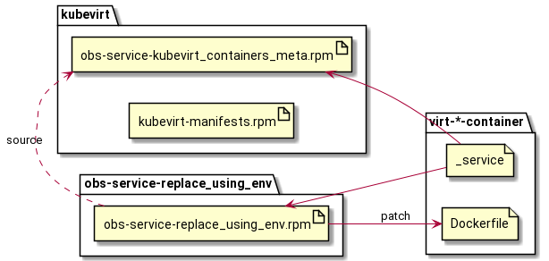

That way the tags and registry information obtained during the build of the manifests RPM get automatically propagated to containers via the build service. The scheme ensures that the released images are properly tagged and eventually the manifests refer to the existing containers.

### Challenge #2: unique tags

The second problem comes from the fact that each KubeVirt release (and actually each build) needs to be identified by a unique tag. That is needed to ensure proper deployment with respect to the default image pull policy [IfNotPresent][3]. The upstream KubeVirt relies on SHA digests: those are calculated from the container images and then injected into the manifests. Unfortunately that is not an option for the downstream build. There is the “chicken-egg” problem: downstream container images depend on the manifests (more precisely: on the meta-data generated when building the manifests) while the SHA digests can be calculated only **after** building the images (and by that time the manifests should be already built to ensure consistent tagging). Apart from that there is currently no straightforward way in OBS to get the SHA digests and somehow provide them to an RPM package.

The solution here is to use the RPM version information provided by OBS during the build of the manifests. The tag can be composed as **%{version}-%{release}**. Assuming that the *%{release}* part gets incremented each time a build is triggered, this scheme ensures unique tags for every build. Using just *%{version}* is not enough since the downstream revisions also need to be considered in order to handle patch updates.

The described approach works well for the Tumbleweed rolling model where everything is automatically rebuilt once a dependency is updated. However it brings certain issues when it comes to fixed releases like the ones for SLE. The containers have strict dependency on the manifests and the generated tags. It is not possible to release only one container since every new update requires a unique tag in order to be properly deployed to a cluster. Therefore it is necessary to build and release all the components together.

### Containerized Data Importer

[Containerized Data Importer][4] (CDI) is another add-on for Kubernetes focused on persistent storage management. It is primarily used for building and importing Virtual Machine Disks for KubeVirt.

CDI introduces DataVolume CR which is an abstraction on top of standard Kubernetes [Persistent Volume Claim][5] (PVC). It is used to automate the creation of VM disks and to populate them with data from various sources: container registries, http servers, local images, etc.

KubeVirt and CDI can work independently but when used together they provide a better user experience. Thus CDI is also maintained downstream and released along with KubeVirt. The CDI project has a similar structure (i.e. it is written in Go language and it uses Bazel for building binaries and container images) and therefore the same “two-steps” approach is used.

### Current state

- Rolling release in Tumbleweed
  - container images available at `registry.opensuse.org/kubevirt/...`
- Tech preview in SLE15 SP2: KubeVirt 0.40.0 and CDI 1.30.0
  - container images available at `registry.suse.com/suse/sles/15.2/...`
- Tech preview in SLE15 SP3: KubeVirt 0.45.0 and CDI 1.37.1
  - container images available at `registry.suse.com/suse/sles/15.3/...`

[The Harvester project][6] adopts SUSE downstream KubeVirt images: the release 0.2.0 uses KubeVirt based on openSUSE Tumbleweed; SLE15 SP3 based images are planned to be used for 0.3.0 and GA.


## Upstream involvement

Areas of contribution:

- Bugfixes and improvements
  - SUSE builds are based on openSUSE and SLE container images and include a different version of the KVM stack: Qemu and Libvirt. While the upstream KubeVirt currently uses Fedora-based containers. That helps with identifying issues that are not reproducible in the upstream CI and improve the interoperability of the project.
- Improving the CI:
  - Helping the community with identifying and fixing flaky tests as well as extending the coverage and efficiency.
- Delivering new features:
  - Initial support of cgroups v2: several issues preventing KubeVirt from running virtual machines on the nodes with cgroups v2 were identified and fixed. Apart from that the pre-submit and periodic jobs on dedicated CI lanes were enabled to avoid regressions. Device handling is still in WIP state though...
  - Live-migration of VMs with hot-plugged volumes: the support of hot-plug volumes has been around for quite a while in KubeVirt. However it was not possible to perform live-migration of virtual machines with dynamically attached storage. Several discussions were initiated around that and a series of patches was introduced to lift that limitation.
  - [WIP] LaunchSecurity with AMD SEV: this is an on-going activity. The idea is to bring the support of confidential computing to KubeVirt. Starting by leveraging the SEV (Secure Encrypted Virtualization) extension available on the AMD’s EPYC CPUs.


## Research: the cost of containerizing VMs

Something that we decided to investigate is what are the differences when it comes to tuning virtualization workloads when using the traditional KVM stack and KubeVirt.
This was a joint project with the NARA Institute of Science and Technology ([NAIST][7]) in Japan and some preliminary results have been presented to [KVM Forum 2021][8].

### Tuning virtualized workloads

One popular and effective way of tuning virtualization workloads is statically or semi-statically partition the resources of the host among the various VMs.
This means doing virtual CPUs (vCPUs) and memory pinning and often also defining a virtual topology for the VMs themselves.
Performance also improve using huge pages and isolating the VMs vCPUs from the interference of any IO activity.

#### vCPU pinning and virtual topology

If our VM has more than one vCPU, it can have a virtual topology, which means that its vCPUs can be arranged in **virtual cores**, **virtual threads**, **virtual sockets** and **virtual NUMA nodes**.

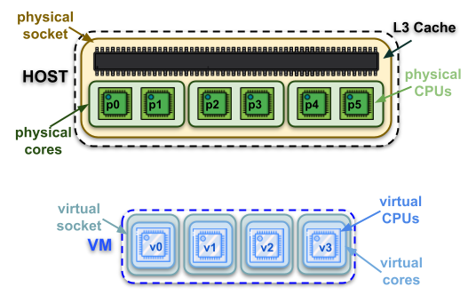

The software running inside of the VM, both the kernel and the user-space programs, will then see such a topology and will make assumptions and enact optimizations that will often lead to better performance.

The following figure shows some examples of virtual topologies:

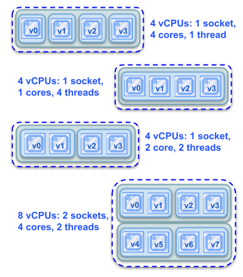

vCPUs can be _pinned_ to the host physical CPUs (pCPUs).
This means that the host scheduler will run the vCPUs only on a specific, and explicitly defined, subset of the host pCPUs (possibly, even only on one).
Using pinning can be very effective for cutting down the overhead of migrating vCPUs among pCPUs, and even more important for partitioning the host resources among the various VMs and.

The two techniques can combine, usually achieving significant cumulative performance improvements, if we pin the vCPUs in such a way that the virtual topology that has been defined for the VM matches the physical topology of the group of pCPUs where the vCPUs of the VM run.
We can also completely disrupt the performance, if we wrongly map the guest virtual topology on the host physical topology, for instance by pinning vCPUs of a virtual core on pCPUs from different physical cores.
And even worse if we also get the resource partitioning part wrong.
Some more considerations on this subject can be found in this [KVM Forum 2020 talk][19].

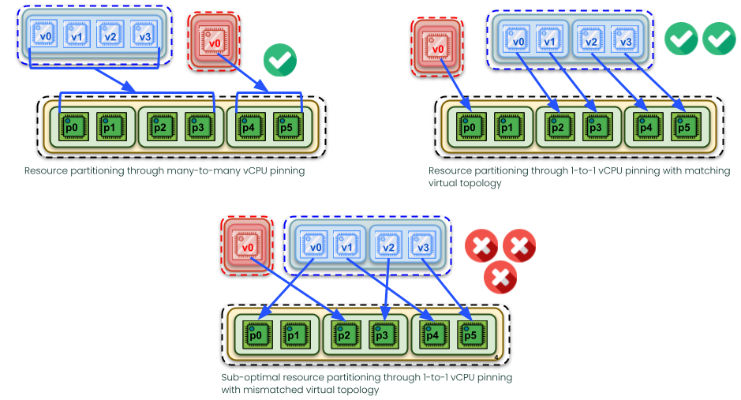

#### Tuning memory and IO

In addition to all that was mentioned in the previous section, if we are pinning the vCPUs on the pCPUs of a specific NUMA node, it makes sense to also make sure that the memory of the VM is entirely allocated on that NUMA node, to avoid the latency of  remote memory accesses.
And there are also other things that we can do like using `host-passthrough` as the CPU model, which we did in our experiments.
Furthermore, we can enable something called `KVM_HINT_DEDICATED` and the `cpuidle-haltpoll` governor inside the guest.
These two features, however, are not covered in this paper (and were not used for the experiments).
More information about them can be found in [this SUSE Labs Conference 2020 talk][20].

Furthermore, using huge (also called large) pages means using memory pages bigger than the default 4 Kilobytes for backing the memory of the VM.
This improves performance because walking the various levels of page tables for translating the VM virtual addresses into host physical addresses happens less often, lowering the pressure on the TLB, and when it happens, it is also faster.
And it is also possible to cut out of QEMU the threads that deal with IO events, in the attempt to improve the scalability of IO itself, and isolate the vCPUs from its interference.
We are still in the process of running experiments with this setup.

Still about IO, for our configuration, which uses a pre-allocated raw disk image, using the so-called _native IO model_ is really important.
The IOzone benchmark, for instance, was not even able to finish unless we used `io=native`.
We are, therefore, doing that for all the benchmarks, on all the cases and scenarios.
Apart from that, IO tuning at the virtual device level happens by specifying a caching mode and whether or not we have and want to use multi-queueing.

### Tuning on KVM

For KVM, 4 different configurations are considered.
The default one (_def_), with no pinning at all for the vCPUs and no virtual topology for the VM.
Then pinning-default and pinning (_pin\_def_ and _pin_, respectively) ones, with 1-to-1 vCPU pinning and either just using the default virtual topology (pin\_def), or defining a custom one with all vCPUs as cores of the same socket (pin).
Finally, the fully tuned (_vtune_) one, whith 1-to-1 vCPU pinning and perfect guest to host virtual topology mapping.

The following code snippets show the relevant part of a VM config file that enacts each configuration:

```xml
<!-- def -->
<vcpu placement='static'>4</vcpu>
<cpu mode='host-model' check='partial'/>
```
```xml
<!-- pin_def -->
<vcpu placement='static'>4</vcpu>
<cputune>
  <vcpupin vcpu='0' cpuset='1'/>
  <vcpupin vcpu='1' cpuset='17'/>
  <vcpupin vcpu='2' cpuset='2'/>
  <vcpupin vcpu='3' cpuset='18'/>
</cputune>
<cpu mode='host-passthrough' check='none'>
```
```xml
<!-- pin -->
<vcpu placement='static'>4</vcpu>
<cputune>
  <vcpupin vcpu='0' cpuset='1'/>
  <vcpupin vcpu='1' cpuset='17'/>
  <vcpupin vcpu='2' cpuset='2'/>
  <vcpupin vcpu='3' cpuset='18'/>
</cputune>
<cpu mode='host-passthrough' check='none'>
    <topology sockets='1' dies='1' cores='4' threads='1'/>
</cpu>
```
```xml
<!-- vtune -->
<vcpu placement='static'>4</vcpu>
<cputune>
  <vcpupin vcpu='0' cpuset='1'/>
  <vcpupin vcpu='1' cpuset='17'/>
  <vcpupin vcpu='2' cpuset='2'/>
  <vcpupin vcpu='3' cpuset='18'/>
</cputune>
<cpu mode='host-passthrough' check='none'>
    <topology sockets='1' dies='1' cores='2' threads='2'/>
</cpu>
```

The following figure shows a graphical representation of each configuration:

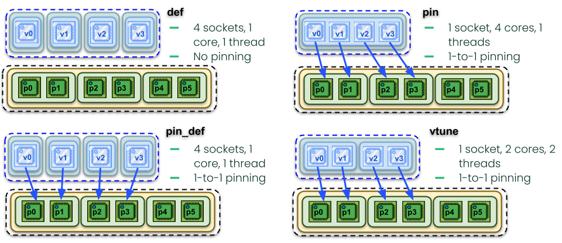

Of course, we expect that it is the last one (vtune) that gives the best results.

### Tuning on KubeVirt

For KubeVirt, we tried to construct the exact same configurations that we built for KVM.

The following code snippets show the relevant part of a VMI definition that enacts each configuration:

```yaml
# def
spec:
  domain:
    resources:
      requests:
        cpu: 4
```
```yaml
# pin_def
spec:
  domain:
    resources:
      requests:
        cpu: 4
    cpu:
      model: host-passthrough
      dedicatedCpuPlacement: true
```
```yaml
# pin
spec:
  domain:
    cpu:
      sockets: 1
      cores: 4
      threads: 1
      model: host-passthrough
      dedicatedCpuPlacement: true
```
```yaml
# vtune
spec:
  domain:
    cpu:
      sockets: 1
      cores: 2
      threads: 2
      model: host-passthrough
      dedicatedCpuPlacement: true
```

The following figure shows a graphical representation of each configuration:

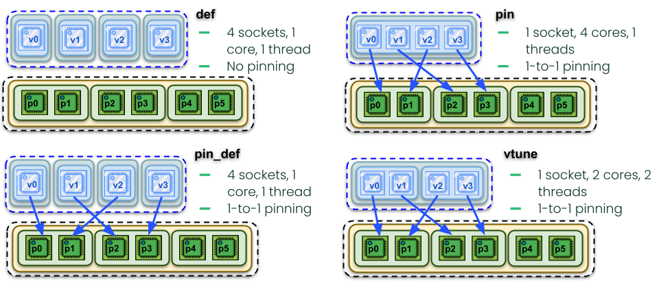

However, in this case, it is Kubernetes' [CPU Manager][21], as well as KubeVirt itself, that are in control of the VM final setup.
And this includes where the vCPUs are pinned and how the virtual topology is defined in details.
As we can see in the figure, what actually happens is that while the pinning is correctly established, the mapping between virtual threads to physical threads is actually wrong, at least for the KubeVirt version we analyzed in this paper.

The experimental evaluation section, will show that this substantially impacts the performance, making what we expected to be the best configuration, one of the worse ones!

### The experimental setup

We used a 32 physical CPUs server both as the KVM host and as the KubeVirt worker node, i.e., where the VMs were actually running, in both cases.
It had two NUMA nodes with 8 cores each and hyperthreading enabled.
In some more details:
- Intel(R) Xeon(R) Silver 4208 CPU @ 2.10GHz
  - CPU(s): 32
  - NUMA nodes (== sockets): 2
  - Threads per core: 2
  - Cores per socket: 8
- Family / Model / Stepping: 6 / 85 / 7
- MHz (min/max): 800 / 3200
- Cache:
  - L1 (i & d): 512 KB
  - L2: 16 MiB
  - L3: 22 MiB
- RAM: 32 GiB (16 GiB on each node)
- Disk:	rotational device (no SSD)

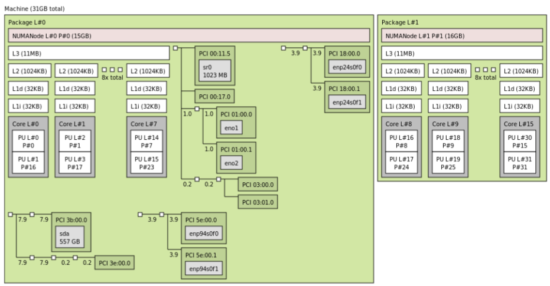

From a software point of view, the host was Ubuntu 20.04.2 LTS, with kernel 5.4.0.
We used the latest available KubeVirt release which, when we run the experiments, was 0.44.0 and included QEMU 5.2.0 and libvirt 7.0.0.
Kubernetes version was 1.21 and the container runtime was [docker][9].
For the KVM experiments, we built from sources and used the very same versions of those components.

We run our experiments inside a 1 vCPU VM, and then we repeated them inside a 4 vCPUs VM.
The VM had 8 Gigabytes of RAM (in both cases) and was running openSUSE Leap 15.2. We used [MMTests][10] as our benchmarking suite, as it can orchestrate running benchmarks inside (one or even multiple) VM(s).

We have run several benchmarks:
- [cyclictest][11]
  - thread wakeup time was 1 ms, they had FIFO priority, and hackbench was running in background
  - 2 configurations:
    - threads pinned to vCPUs
    - threads not pinned (unbound)
- [NASA Parallel Benchmark][12]
  - 2 threads (which is the half the number of vCPUs of our VM) in parallel, via [OpenMP][13]
  - various computational kernels:
    - bt, cg, ep, ft, is, sp, ua
- [STREAM][14]
  - 2 threads (which is the half the number of vCPUs of our VM) in parallel, via [OpenMP][13]
  - multiple memory operations:
    - copy, scale, add, triadd
- [hackbench][15]
  - with multiple processes, communicating via pipes (implemented by `perf bench sched pipe`)
  - 2 configurations:
    - processes groups (80 tasks), 4 thread groups (160 tasks)
- [kernbench][16]
  - with `vmlinux` as build target (with `defconfig`)
  - 4 configurations:
    - `make -j 1`, `make -j 2` and `make -j 4`
- [iozone][17]
  - for synchronous IO
  - multiple operations:
    - write, rewrite, read, reread, random red, random write, backward read
  - multiple configurations (with different file sizes):
    - 1GB, 2GB, 4GB

All benchmarks were, of course, running inside the VMs.
We have also considered different load conditions for the host.
In fact, We run all the benchmarks on an host which was only running our VM, and was otherwise idle.
Then we run them while imposing, at the same time, an extraneous 50% load on the host and also with 100% extraneous load.
For generating load on the host we used various [stress-ng][18] threads in a way that they can simulate having had other VMs running at the same time of our one.
Basically, in what we call the _idle host_ case, only the VM was running.
In the _host loaded_ case, `stress-ng` was used to generate a 1400% (out of a total of 3200%) artificial load on the host.
This can be considered representative of a situation where the host would be running 7 additional (to our one) VMs with 4 vCPUs, each one of which is 50% loaded.
Finally, in the _highly loaded_ case, `stress-ng` was generating approximately 2800% artificial load, which could be considered similar to having 7 additional VMs with 4 vCPUs, each of which is 100% loaded.
Considering that also our VM had (at most) 4 vCPUs, the highly loaded case was indicative of a fully loaded, but not oversubscribed, situation.

This paper includes a subset of all the results that we collected.

Note that version 0.45 of KubeVirt [incorporates changes][22] to how vCPU pinning and virtual topology are handled that should mitigate some of the issues that our investigation highlighted (see the following sections). We are planning to repeat our experiments with such (or later) version in order to verify if that is the case, and if yes, up to what extent.

## Experimental results

### STREAM

The figure shows the results of STREAM, running within 2 tasks in parallel, inside a 4 vCPUs VM, for KVM and KubeVirt, under different host load scenarios.
Note that running with only 2 STREAM tasks in parallel does not saturate the memory bandwidth of our platform.
This means that we should not expect big improvements, as compared to the default configuration, when applying the tuning.
Tuning, however, should definitely not lower the performance.

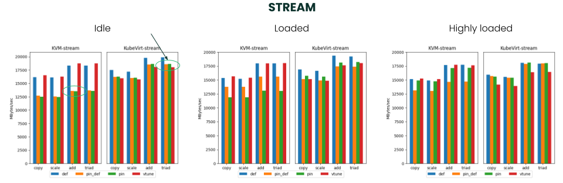

It is easy to see how, for KVM, the vtune configuration is always the best one, under any host load scenario.
On the other hand, doing vCPU pinning and not defining a virtual topology for the guest that matches the one of the pCPUs of the host on which the vCPUs are pinned (i.e., the pin\_def and pin cases), always means worse performance as compared to not doing any pinning and virtual topology at all.

We think that this is due to the fact that with the default virtual topology, since all the vCPUs are treated like they were each one a single and separate socket, the benchmark tasks are only sporadically migrated from a vCPU to another one by the guest scheduler.
At the same time, since there is no vCPU pinning, the host scheduler is free to move the vCPUs around among the pCPUs and enact, even under high load, very good working conditions.
On the other hand, when we do vCPU pinning, we make it impossible for the host scheduler to do the same.
This means that things are entirely in the hands of the guest scheduler and hence how the virtual topology inside of the VM is defined and whether or not it matches the physical topology becomes important.
This therefore explains why the vtune cases, which can take advantage of both pinning and a properly defined virtual topology, manages to reach the same performance as the def cases.

Similar considerations apply to KubeVirt.
In this case, however, there is no configuration where the virtual topology is defined in a way that it matches the physical one (not even vtune).
This therefore explains why, for KubeVirt, def is always the best performing configuration and vtune is, as a matter of fact, always the worst one.
Which basically means that, for this benchmark, trying to tune a KubeVirt system, following the same principles that works well on KVM, may actually lead to worse performance.

### NPB

The figure shows the results of NPB, running within 2 tasks in parallel, inside a 4 vCPUs VM, for KVM and KubeVirt, under different host load scenarios.

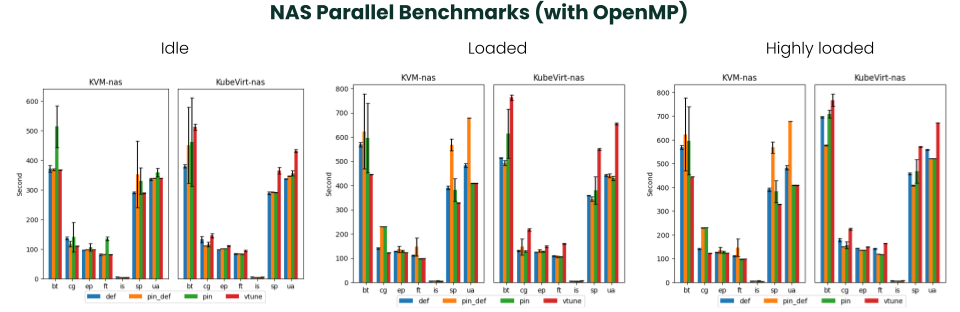

The NPB benchmark behave similarly to STREAM.
It being a compute intensive benchmark, however, makes it even more sensitive to where tasks actually run, especially on a system with multiple threads per cores, like our server.
We, in fact, see that, both for KVM and KubeVirt, the pin\_def and pin configurations perform better, some of the times, and worse, some other times, as comapred to def.
This indeed depends on the combined work of the host and guest scheduler and actual results cannot be easily and reliably predicted.
Therefore, none of this configurations should be considered a good one.

When vtune is used, in the KVM case this consistently lead to best performance, as it was expected.
Note also how, while def and vtune are very similar on an idle host, the difference between them increases (in favor of vtune) when the load on the host is higher.

On KubeVirt, it is again the opposite: vtune consistently leads to worse performance than doing no tuning at all.
So, even for NPB, tuning a KubeVirt system via resource partitioning is currently impossible.

### cyclictest

The figure shows the results of cyclictest, running with 4 tasks, inside a 4 vCPUs VM, for KVM and KubeVirt, under different host load scenarios.
Each of the task is pinned to one of the VM vCPUs.
This means that the guest scheduler, and hence the virtual topology of the VM, cannot have any impact on the results.
What we can, therefore, expect is that running cyclictest inside a VM will be sensitive to vCPU pinning, but not so much to virtual topology.
We show, for each configuration, both the average and the maximum latency achieved, among of all these 4 tasks.

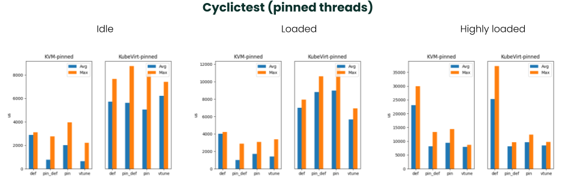

The KVM results meet the previously stated expectations.
In fact, all the tuned configurations (pin_def, pin and vtune) are, with only one exception (the maximum for the pin case, on an otherwise idle host), better than def.
In particular, vtune (still on KVM), is again the overall best performing option.

The beneficial effect of pinning, and its prevalence against any impact that virtual topology might have on the results, applies to the KubeVirt highly loaded scenario too.
However, it is still unclear to us why, on KubeVirt:
- in the idle and lightly loaded host scenarios, pinning does not help (actually, it often makes things worse);
- the KubeVirt results are, overall, significantly worse than the KVM ones.

Further investigation is ongoing in order to better understand these two aspects.

### Kernbench

The figure shows the result of running kernbench inside a 4 vCPUs VM while the host was: (a) idle, (b) lightly loaded and (c) highly loaded.
Data point 1 in the plots corresponds to single job kernel builds (`-j1`); data point 2 to kernel builds with 2 jobs (`-j2`); data point 4 to build with 4 jobs (`-j4`). 

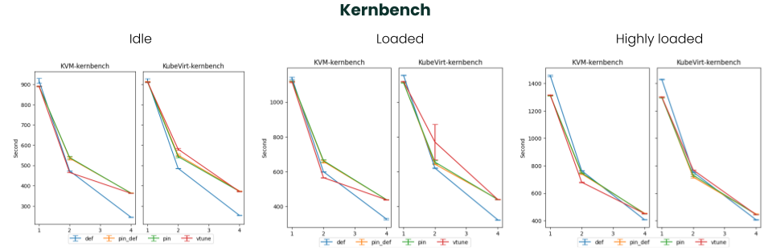

Kernbench is probably the most effective benchmark when it comes to showing how tuning is the most effective under specific load conditions.
In fact, in the idle and lightly loaded host scenarios, pinning the vCPUs can lead to slowdowns, not only in the KubeVirt case (that are affected by the topology mismatch problem) but in the KVM one as well.

In those cases, all the tuned configuration, with the only exception of vtune on KVM, performs worse than def.
This is because in the def case the host scheduler is always able to make each of the VM's vCPUs that are busy run on one physical core.
The vCPUs are therefore executing on one of the threads of such core, while the other thread is idle, and this guarantees good performance.
On the other hand, if we pin the vCPUs on 2 cores (which is what happens in the pin_def, pin and vtune cases), when all the 4 vCPUs of the VM are busy (e.g., when we run with `-j4`) they need to use both the threads of the cores.
And this is the case even if, since there is either no or only light extraneous host load, there are other cores of the host that are fully idle.
This explains why in the `-j4` case all the configurations, including vtune on KVM, are worse than default.

It is interesting to note how the vtune configuration, on KVM, manages to always beat def, the most interesting example of this being the loaded host scenario.
This happens despite the fact that pinning makes it impossible for the host scheduler to distribute efficiently the vCPUs on the cores, and the 4 vCPUs of the VM all run on 2 cores, potentially saturating their thread count.
It is, however, the guest kernel scheduler that is now able to schedule the active tasks on separate cores, e.g., in the `-j2` case, thanks to the fact that we have defined a matching virtual and physical topology.
Of course, this can't work for `-j4`, as in that case there is enough work to do inside the VM for saturating the 2 cores its vCPUs are forced to run on.
This is, in fact, why def keeps being better even than vtune, for `-j4`, in both the idle and lightly loaded host scenarios. 
And this is also confirmed by the fact that, in the highly loaded scenario instead, where we saturate the CPU bandwidth even at the host level, the performance of def and vtune are much more similar.

Overall, vtune can be considered the best solution, for KVM.

For Kubevirt, we observe here as well the phenomenon that, due to the topology mismatch, vtune is the worst performing configuration. For instance, in the `-j2` run, loaded host scenario, vtune reaches both terrible and very inconsistent performance.


## References

[1]: https://github.com/kubevirt/kubevirt
[2]: https://github.com/kubevirt/kubevirt/blob/main/docs/README.md
[3]: https://kubernetes.io/docs/concepts/containers/images/#image-pull-policy
[4]: https://github.com/kubevirt/containerized-data-importer
[5]: https://kubernetes.io/docs/concepts/storage/persistent-volumes/
[6]: https://github.com/harvester/harvester
[7]: http://www.naist.jp/en/
[8]: https://www.youtube.com/watch?v=x_czS9Iuo2o
[9]: https://www.docker.com/
[10]: https://github.com/gormanm/mmtests
[11]: https://wiki.linuxfoundation.org/realtime/documentation/howto/tools/cyclictest/start
[12]: https://www.nas.nasa.gov/software/npb.html
[13]: https://www.openmp.org/
[14]: https://www.cs.virginia.edu/stream/
[15]: https://man7.org/linux/man-pages/man1/perf-bench.1.html
[16]: http://ck.kolivas.org/apps/kernbench/kernbench-0.50/
[17]: https://www.iozone.org/
[18]: sttress-ng
[19]: https://www.youtube.com/watch?v=8yA2SNnx2Ko
[20]: https://youtu.be/3tUTxGpwMUc
[21]: https://kubevirt.io/user-guide/virtual_machines/dedicated_cpu_resources/
[22]: https://github.com/kubevirt/kubevirt/pull/6251
